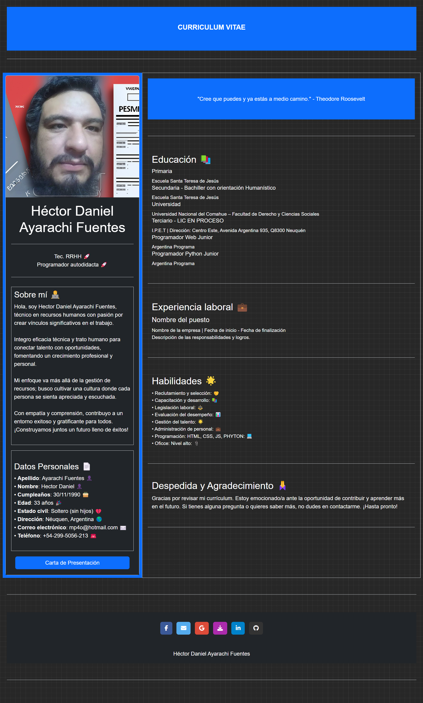

<h1 align="center">
  
   
   Currículum Vitae
      
   Héctor Daniel Ayarachi Fuentes
</h1>

Contactos

  

  
 

 

## Sobre mi

**¡Hola!** 

 Soy un **desarrollador web** entusiasta que está comenzando en este apasionante mundo del desarrollo. Con sólidos conocimientos en **HTML, CSS y JavaScript**, estoy emocionado por aprender y crecer en este campo. Mi objetivo es crear experiencias web impactantes y funcionales que cautiven a los usuarios. Estoy constantemente explorando nuevas tecnologías y estoy listo para enfrentar desafíos emocionantes en el mundo del desarrollo web.

## Vista previa del CV en responsivo     

Podes verlo en [PDF](https://hectordanielayarachifuentes.github.io/CV/)

| Movil | Notebook |
|:---:|:---:|
|   |  |

#### Vista previa del CV  

Podes verlo en [PDF](https://hectordanielayarachifuentes.github.io/CV/)

| Vista completa |
|:---:|
 |

| Tablet |
|:---:|
|   | 

</head>
<body>

<button id="reproducir-audio">Reproducir Audio</button>
<audio id="mi-audio" controls>
    <source src="Ven-a-Mí.mp3" type="audio/mpeg">
</audio>

